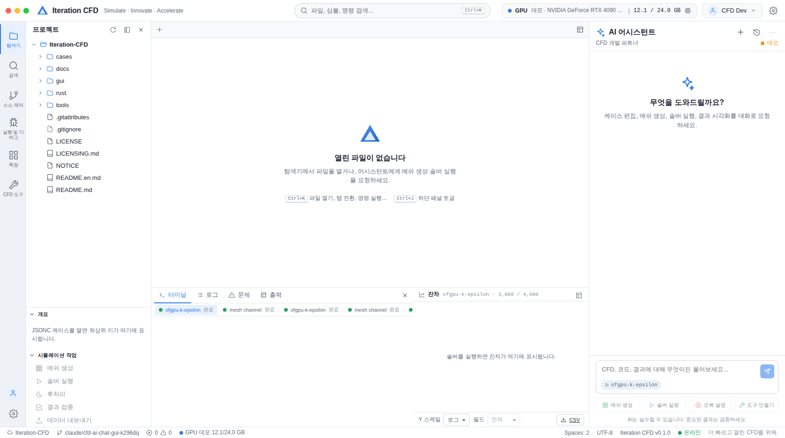
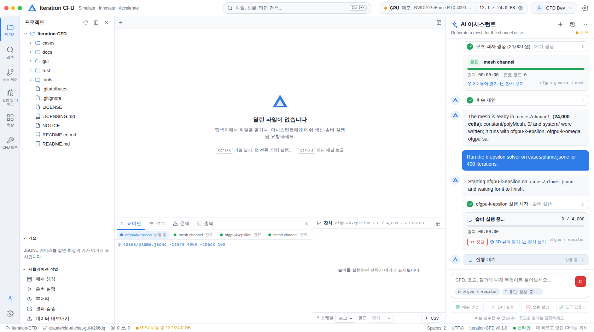
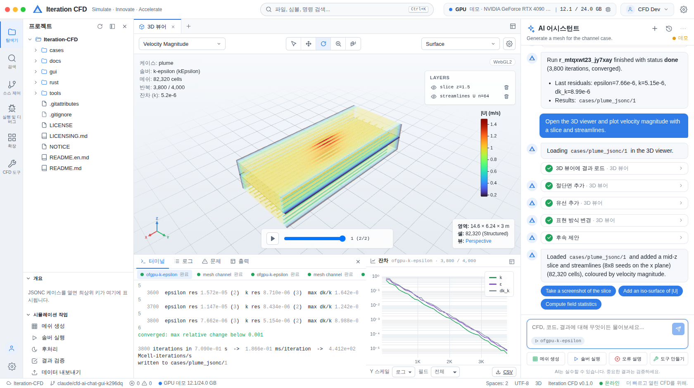

# Iteration CFD Studio

meteor-cfd(Iteration CFD) 솔버를 **AI 채팅으로 구동하는** Cursor/Codex 스타일 개발 환경입니다. 어시스턴트가 케이스(JSONC)를 읽고 고치고, 메쉬를 만들고, 솔버를 실행·감시하고, 결과를 WebGPU 3D 뷰어에 띄우는 일을 전부 **툴 콜링**으로 수행합니다.

설계 결정과 단계는 [`PLAN.md`](PLAN.md), **다음에 할 일과 리뷰에서 확인된 결함 목록은 [`TODO.md`](TODO.md)** 에 있습니다.

```
gui/
  shared/   서버·웹 공용 계약: WS 프로토콜, 뷰어 명령, 데이터셋 형식, 잔차 파서, 바이너리/모델 레지스트리, 도구 목록, i18n
  server/   Node 22 + TypeScript: Claude 에이전트 루프, 도구, 프로세스 러너, 데모 모의 솔버, 결과 리더, REST/WS
  web/      Vite + React 19: VS Code형 셸, Monaco, xterm, uPlot 잔차 차트, three.js WebGPU 뷰어
  e2e/      Playwright 데모 모드 스모크 테스트
```

## 스크린샷 (데모 모드, Playwright 자동 캡처)

| 셸 | 솔버 실행과 잔차 | 3D 뷰어(절단면 + 유선) |
|---|---|---|
|  |  |  |

## 빠른 시작

요구사항: Node 22 이상. 실제 솔버를 돌리려면 빌드된 `ofgpu-*` 바이너리(Windows + NVIDIA GPU, `rust/README.md` 참고)가 필요하고, 없으면 **데모 모드**로 전부 체험할 수 있습니다.

```bash
cd gui
npm install

# 1) 데모 모드 — GPU도 API 키도 필요 없음 (모의 솔버 + 대본형 모의 어시스턴트)
CFD_DEMO=1 npm run dev

# 2) 실제 모드 — Claude API 키 + 빌드된 바이너리
export ANTHROPIC_API_KEY=sk-ant-...
export OFGPU_BIN_DIR=/path/to/rust/target/release   # 생략하면 rust/target/release → cargo run 순으로 찾음
npm run dev
```

브라우저에서 <http://127.0.0.1:5173> 을 엽니다(서버는 8787 포트, Vite가 `/api`·`/ws`를 프록시). 프로덕션 빌드는 `npm run build` 후 `npm start`(서버가 `web/dist`를 직접 서빙).

환경변수 전체 목록은 [`.env.example`](.env.example)에 있습니다.

## 어시스턴트가 쓰는 도구

| 도구 | 하는 일 | 승인 |
|---|---|---|
| `case_read` / `case_validate` | JSONC 케이스 읽기, `docs/schema/case-1.json` 스키마 + 의미 검증(모델↔드라이버, lowRe, 출력 열) | 자동 |
| `case_create` / `case_edit` | 템플릿에서 케이스 생성, JSON 포인터 편집(주석 보존, diff 미리보기) | 확인 |
| `mesh_generate` | `ofgpu-generate-mesh` 프리셋(channel/cavity/step/big/plume/room/damBreak) + STL/컷셀/벽모델/cyclic | 확인 |
| `run_start` / `run_wait` / `run_status` / `run_log` / `run_stop` | 솔버·분석 바이너리 실행(레지스트리로 플래그 검증, 단일 GPU 큐), 대기, 상태, 로그, 중단 | 실행·중단 확인 |
| `results_discover` / `field_stats` / `residuals_get` | 시간 디렉터리·VTK 탐색, 필드 통계, 잔차 시계열 | 자동 |
| `viewer_command` / `plot_residuals` | 3D 뷰어 조작(load, setField, addSlice, addIsoSurface, addStreamlines, addGlyphs, setCamera, screenshot…), 잔차 차트 | 자동 |
| `file_read` / `file_list` / `file_search` / `file_write` | 워크스페이스 파일(경로 안전) | 쓰기 확인 |
| `spec_lookup` | `rust/SPEC-LIT.md` §절 조회·검색 | 자동 |
| `gpu_info` | nvidia-smi(실제) / 데모 값 | 자동 |
| `custom_tool_create` / `custom_tool_run` | 사용자 정의 도구(argv 명령 또는 로컬 JS) — 보안 경계가 아님 | 확인 |
| `shell_exec` | 임의 명령 — 기본 **금지** | 설정 |

각 `ofgpu-*` 바이너리와 난류 모델·벽처리·알고리즘·출력 형식의 목록은 `shared/src/registry.ts`에 있고, 서버의 동기화 테스트가 `rust/Cargo.toml`·각 바이너리의 `usage()`와 대조합니다.

## 데모 모드가 하는 일

- 모의 솔버가 **실제 드라이버와 같은 형식**의 로그(배너, 계수, 잔차 줄, `converged`, `written to`)를 내고 foam ASCII / polyMesh / VTU(타입 42) 결과 파일을 씁니다. 잔차 파서·뷰어 리더가 실제와 같은 경로를 탑니다.
- 모의 어시스턴트가 "메쉬 생성" → "솔버 실행" → "3D 뷰어" 시나리오를 실제 도구 호출로 재현합니다(승인 카드, diff 카드, 거부·오류 카드 포함).

## 검증

```bash
npm run typecheck      # tsc: shared, server, web
npm test               # vitest: 파서·포맷·루프·리듀서·뷰어 알고리즘
npm run build          # vite build + tsc
npm run e2e            # Playwright: 데모 모드로 메쉬 → 실행 → 잔차 → 뷰어 (WebGL2 강제)
```

## 실제 GPU 기기에서의 체크리스트

1. `cargo build --release`(CUDA 13, VS 2022)로 바이너리를 만들고 `OFGPU_BIN_DIR`를 가리킵니다.
2. `ANTHROPIC_API_KEY`를 설정하고 `npm run dev`.
3. 어시스턴트에게 "cases/plume.jsonc를 k-epsilon으로 400회 돌려줘"라고 요청 → 승인 → 잔차 차트 → "3D 뷰어로 보여줘".
4. 상태바의 GPU 배지가 `nvidia-smi` 값을 보이는지, 실행 중 `Busy`로 바뀌는지 확인합니다.
5. Chrome/Edge 최신판에서 뷰어 배지가 `WebGPU`인지 확인합니다(three r185의 WebGPU 경로가 브라우저 버전에 민감해 실패하면 자동으로 WebGL2로 내려갑니다).

## 라이선스와 제3자 구성요소

이 폴더는 저장소의 라이선스(`../LICENSE`, Prosperity Public License)를 따릅니다. 사용한 오픈소스: three.js, React, zustand, Monaco Editor, xterm.js, uPlot, react-markdown, highlight.js, ws, ajv, jsonc-parser, zod, Vite, vitest, Playwright, @anthropic-ai/sdk — 모두 MIT/Apache-2.0 계열입니다.
